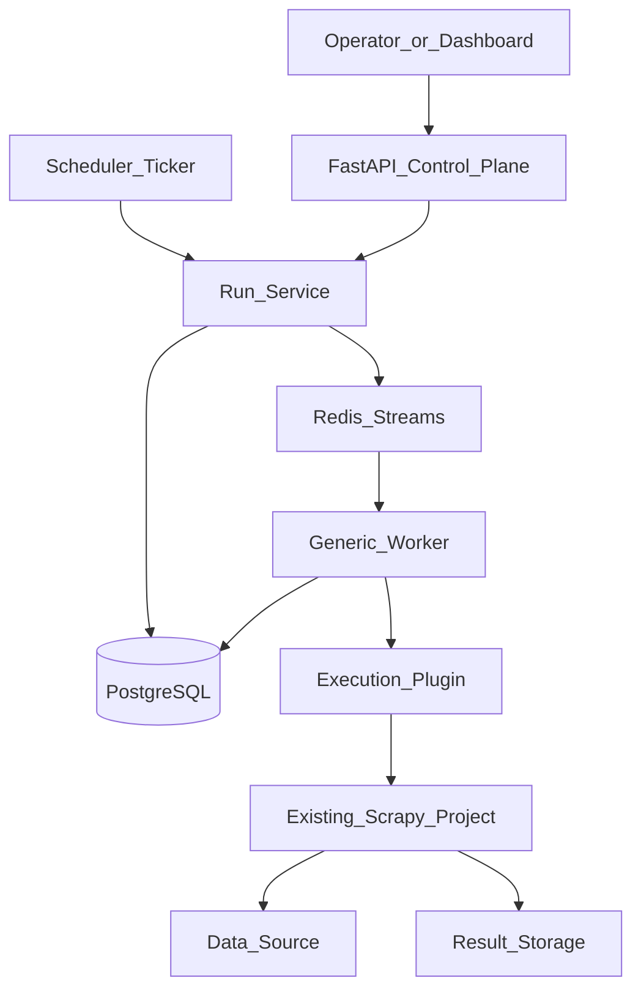

# Dataflow Platform

An open-source control plane for scheduling, executing, monitoring, and scaling
data-collection workloads.

> This project is an orchestration platform, not another web-scraping framework.
> Scrapy is the first execution engine, but the platform is designed to support
> additional engines through plugins.

## Project status

The project is currently in the architecture and foundation phase. The first
milestone is a production-quality vertical slice that replaces ad-hoc execution:

```text
register scraper → enqueue run → execute Scrapy spider → persist run history
```

The accepted architecture decisions are documented in [`docs/adr`](docs/adr).

## Why this project exists

TeamCrawlers currently operates an existing Scrapy project containing production
spiders. Those spiders are run sequentially by cron and shell scripts:

```text
cron → spider A → spider B → spider C → result storage
```

This approach works, but it does not provide:

- Centralized scraper and job management
- Reliable retries and failure recovery
- Searchable execution history
- Queue and worker visibility
- Worker heartbeats
- A scheduling interface
- Consistent logs and metrics
- A straightforward path to horizontal scaling

The platform will replace the orchestration performed by cron while preserving
the existing Scrapy project and its business-specific scraping logic.

## Goals

### Operational platform for TeamCrawlers

Every data-collection workload should eventually be registered, scheduled,
executed, monitored, retried, and audited through one system.

### Flagship open-source engineering project

The repository is intended to demonstrate production engineering practices
expected from senior data and platform engineers:

- Distributed system design
- Queue and scheduling semantics
- Worker lifecycle management
- Reliable state transitions and retries
- Backend and API architecture
- Observability and operational tooling
- Database migrations and data modelling
- Testing, documentation, and architecture decisions

### Foundation for a hosted product

The initial deployment is deliberately small and sequential. Its boundaries
should still support future capabilities such as:

- Distributed workers and horizontal scaling
- Multiple execution engines
- Authentication and API keys
- Teams, workspaces, and multi-tenancy
- Client dashboards
- Notifications and webhooks
- Proxy management
- AI-assisted extraction workflows

These are future capabilities, not MVP requirements.

## Design principles

### Orchestration is separate from execution

The platform owns scraper registration, schedules, run state, dispatch, retries,
and history. Execution plugins own the mechanics of running a workload. Website-
specific selectors and extraction logic never belong in the control plane.

### Execution engines are plugins

The worker resolves an engine by name and invokes a stable contract:

```text
execute(task: {scraper_name, workload, params})
  → {ok, exit_code, log_ref, error}
```

Scrapy is the first implementation. Future implementations may execute
Playwright automation, Selenium jobs, API ingestion, RSS feeds, file downloads,
or AI extraction workflows without changing the worker framework.

### PostgreSQL is the source of truth

Scraper metadata, schedules, run status, attempts, timestamps, worker ownership,
and errors are persisted in PostgreSQL.

Redis transports work; it does not own the authoritative run state.

### Scale through configuration

The MVP runs one task at a time. Redis Streams consumer groups and idempotent
database transitions allow additional workers to be introduced without
redesigning the execution path.

### Every run is observable

Each run must have a durable state, timestamps, attempt number, worker identity,
captured logs, and a terminal success or failure result.

## Target architecture



### Initial technology choices

- **API:** FastAPI
- **Metadata and run state:** PostgreSQL
- **Queue:** Redis Streams with consumer groups
- **Worker:** Python worker with initial concurrency set to one
- **First execution plugin:** Scrapy subprocess adapter
- **Scheduling:** PostgreSQL-backed cron expressions and a lightweight ticker
- **Migrations:** Alembic
- **Local infrastructure:** Docker Compose

Dagster remains a possible future scheduler integration. It will sit behind the
same run-enqueue boundary rather than becoming a requirement for worker
execution.

## MVP execution flow

1. A scraper is registered with an engine, workload name, and configuration.
2. An operator or scheduler requests a run.
3. The API creates a `queued` run in PostgreSQL.
4. The run ID is appended to a Redis Stream.
5. A worker claims the message through a consumer group.
6. The worker atomically transitions the run to `running`.
7. The Scrapy plugin invokes `scrapy crawl <spider>` in a subprocess.
8. Standard output and errors are captured under the run's log reference.
9. The worker records `succeeded` or `failed` and acknowledges the message.
10. Failed runs can be retried as a new attempt with their history preserved.

## Core data model

### Scraper

- Stable name
- Execution engine
- Workload or spider name
- Engine configuration
- Enabled state

### Job run

- Scraper reference
- Status: `queued`, `running`, `succeeded`, or `failed`
- Attempt number
- Parameters
- Worker identity and heartbeat
- Queued, started, and finished timestamps
- Error and log reference

### Schedule

- Scraper reference
- Cron expression
- Enabled state
- Last enqueue time
- Next due time

## Planned API surface

```text
GET  /scrapers
POST /runs
GET  /runs
GET  /runs/{run_id}
POST /runs/{run_id}/retry
POST /schedules
GET  /schedules
```

The API and scheduler will use the same internal run service so manual and
scheduled runs have identical execution semantics.

## Delivery roadmap

### Phase 0 — Foundation

- Reproducible Python project and dependency management
- Docker Compose for PostgreSQL and Redis
- Configuration and secret handling
- Architecture Decision Records
- Testing and linting foundations

### Phase 1 — Execution spine

- Scraper and job-run database models
- Alembic migrations
- Redis Streams producer and consumer
- Sequential generic worker
- Scrapy execution plugin
- Run creation, history, and retry API
- Import of existing scraper metadata
- One verified end-to-end production spider run

### Phase 2 — Replace cron

- PostgreSQL-backed schedules
- Lightweight scheduler ticker
- Retry policies and backoff
- Stuck-run detection and recovery
- Incremental migration of existing spiders
- Retirement of production cron and shell runners

### Phase 3 — Operations

- Operational dashboard
- Structured logs and centralized log access
- Run-duration, throughput, and failure metrics
- Queue visibility and worker heartbeats
- Alerts and notifications
- Polished API and operator documentation

### Later phases

- Multiple workers and configurable concurrency
- Additional execution-engine plugins
- Authentication, API keys, and workspaces
- Multi-tenant isolation
- Webhooks and external integrations
- Optional Dagster integration

## Reliability model

- Queue delivery is **at least once**.
- Run transitions must be idempotent.
- PostgreSQL is authoritative when queue state and run state disagree.
- Messages are acknowledged only after the run reaches a durable terminal state.
- Crashed-worker messages remain pending for later reclaim.
- Retries create explicit attempts instead of erasing previous failures.

## Non-goals for the first release

- Rewriting the existing spiders
- Moving extraction logic into the platform
- Building a general-purpose scraping framework
- Running many jobs concurrently
- Introducing multi-tenancy before the execution path is proven
- Building a polished SaaS dashboard before stable operational APIs exist

## Architecture decisions

- [ADR-001: Orchestration vs execution separation](docs/adr/001-orchestration-vs-execution.md)
- [ADR-002: Redis Streams for work dispatch](docs/adr/002-redis-streams-dispatch.md)
- [ADR-003: Lightweight scheduler for the MVP](docs/adr/003-lightweight-scheduler.md)

## Success criteria

The first major release is successful when:

- Production cron jobs have been replaced by platform schedules.
- Existing Scrapy spiders run through workers without being rewritten.
- Runs can be created, monitored, retried, and audited centrally.
- Every run has durable history and accessible logs.
- Adding worker capacity is a deployment change rather than an architecture
  rewrite.
- A new execution engine can be added as a plugin without changing the core
  orchestration flow.

## Contributing

The project is at an early stage. Architecture discussions, ADR feedback, tests,
documentation, and focused implementation proposals are welcome. Changes should
preserve the separation between orchestration and workload-specific execution.
